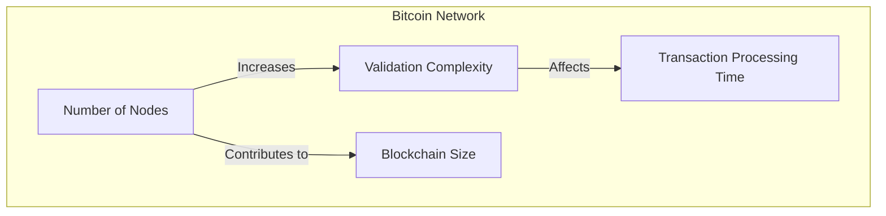

### Bitcoin

Bitcoin is a decentralized digital currency that operates on a peer-to-peer network of computers. Here is how Bitcoin works in terms of a network of computers, the distributed ledger, and immutability:

#### Network of Computers

Bitcoin operates on a network of computers called nodes. These nodes are distributed across the globe and work together to validate and record transactions. Each node stores a copy of the entire Bitcoin blockchain and follows a consensus protocol (Consensus is discussed in the next chapter) to agree on the validity of transactions.

- **Nodes**: Individual computers that participate in the Bitcoin network. They store the blockchain, validate transactions, and propagate information across the network.

#### Distributed Ledger

Bitcoin's blockchain is a distributed ledger, meaning it is a digital record of all transactions that is duplicated and distributed across the entire network of nodes.

The ledger is not stored in a single location or controlled by a single entity. Instead, it is spread across thousands of nodes worldwide, ensuring there is no single point of failure or control.

#### Immutability

Each block in the Bitcoin blockchain contains a cryptographic hash of the previous block, creating a chain of blocks. This linkage ensures that altering any block would require altering all subsequent blocks, which is computationally infeasible.

### Challenges with Bitcoin's architecture

Every participating node in the network must validate each transaction. This validation process ensures consensus and security but introduces challenges as the network scales:

- **Validation Process**: Every transaction on the Bitcoin network must be validated by all nodes. This means each node independently verifies the legitimacy of transactions, which takes time.

- **Scalability Challenges**: As more nodes join the network over time, the number of validations needed for each transaction increases. This can lead to slower transaction processing times, especially during periods of high network activity.

- **Impact on Speed**: The requirement for universal validation by all nodes can result in slower transaction speeds compared to centralized systems or newer blockchain technologies designed for higher throughput.

