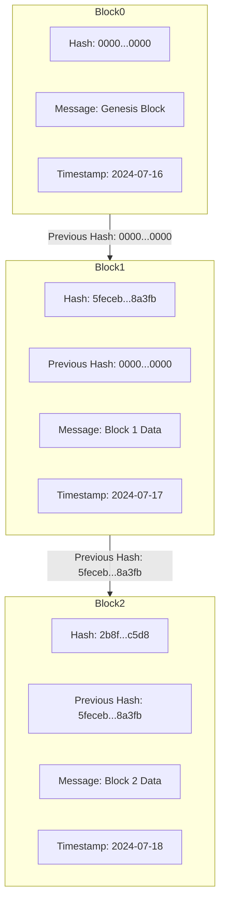

# What is a blockchain?

A blockchain is a distributed ledger technology that records transactions across many computers in such a way that the registered transactions cannot be altered.

## Why can't transactions be altered?

The immutability of blockchain systems is due to the properties of hash functions which are used extensively by blockchain systems.

## What is a hash function?

It's a function that takes in data of any size and produces an output of a fixed size.

hash(data)->output

The output of a hash function is ‘random looking’ but it is deterministic because if you provide the same input to the hash, you will get the same output.

A popular hash function is sha256.
Below is a command to hash 0 using sha256 on an Ubuntu environment.

```
echo -n "0" | sha256sum

```

The output will always be ,

```text
5feceb66ffc86f38d952786c6d696c79c2dbc239dd4e91b46729d73a27fb57e9
```

## The avalanche effect

All hash functions should exhibit this trait. It is the idea that changing 1 bit in the input of the hash function should change about half the output bits. This is the trait that ensures immutability of blockchain systems. Let's see how.

Each block contains a hash, which is generated based on the block's contents: the previous block's hash, the current block's message (data), and the timestamp. If any of these components are altered, the hash of the block changes, which in turn affects the hashes of all subsequent blocks.

To illustrate this, consider the following blockchain:



## Explanation

If we change any part of Block1 (such as the message or timestamp), the hash of Block1 will change. Consequently, since Block2's hash is partly based on Block1's hash, the hash of Block2 will also change. This chain reaction ensures that any modification to a single block invalidates all subsequent blocks, making the blockchain immutable.

### Useful Features of a Blockchain

To recap, a blockchain is an immutable distributed ledger. It is distributed in the sense that information doesn't reside on a single server, thereby solving the problem of a single point of failure. It is immutable because changing a single piece of information would alter the entire chain.

The most useful features of a blockchain are:

1. **Distributed**: Information is shared across a network of nodes, reducing the risk of a single point of failure.
2. **Immutable**: Once data is recorded, it cannot be altered without affecting the entire chain, ensuring data integrity and security.
3. **Decentralized**: Control is distributed across a network rather than being centralized in a single entity, promoting transparency and trust.
4. **Secure**: Cryptographic algorithms protect the data, making it difficult for unauthorized parties to alter the information.


