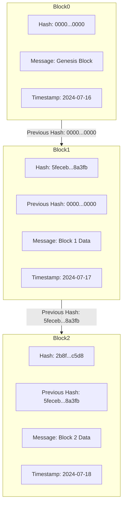

# What is a blockchain?

A blockchain is a distributed ledger technology that records transactions across many computers in such a way that the registered transactions cannot be altered.

## Why can't transactions be altered?

The immutability of blockchain systems is due to the properties of hash functions which are used extensively by blockchain systems.

## What is a hash function?

It's a function that takes in data of any size and produces an output of a fixed size.

hash(data)->output

The output of a hash function is ‘random looking’ but it is deterministic because if you provide the same input to the hash, you will get the same output.

A popular hash function is sha256.
Below is a command to hash 0 using sha256 on an Ubuntu environment.

```
echo -n "0" | sha256sum

```

The output will always be ,

```text
5feceb66ffc86f38d952786c6d696c79c2dbc239dd4e91b46729d73a27fb57e9
```

## The avalanche effect

All hash functions should exhibit this trait. It is the idea that changing 1 bit in the input of the hash function should change about half the output bits. This is the trait that ensures immutability of blockchain systems. Let's see how.


