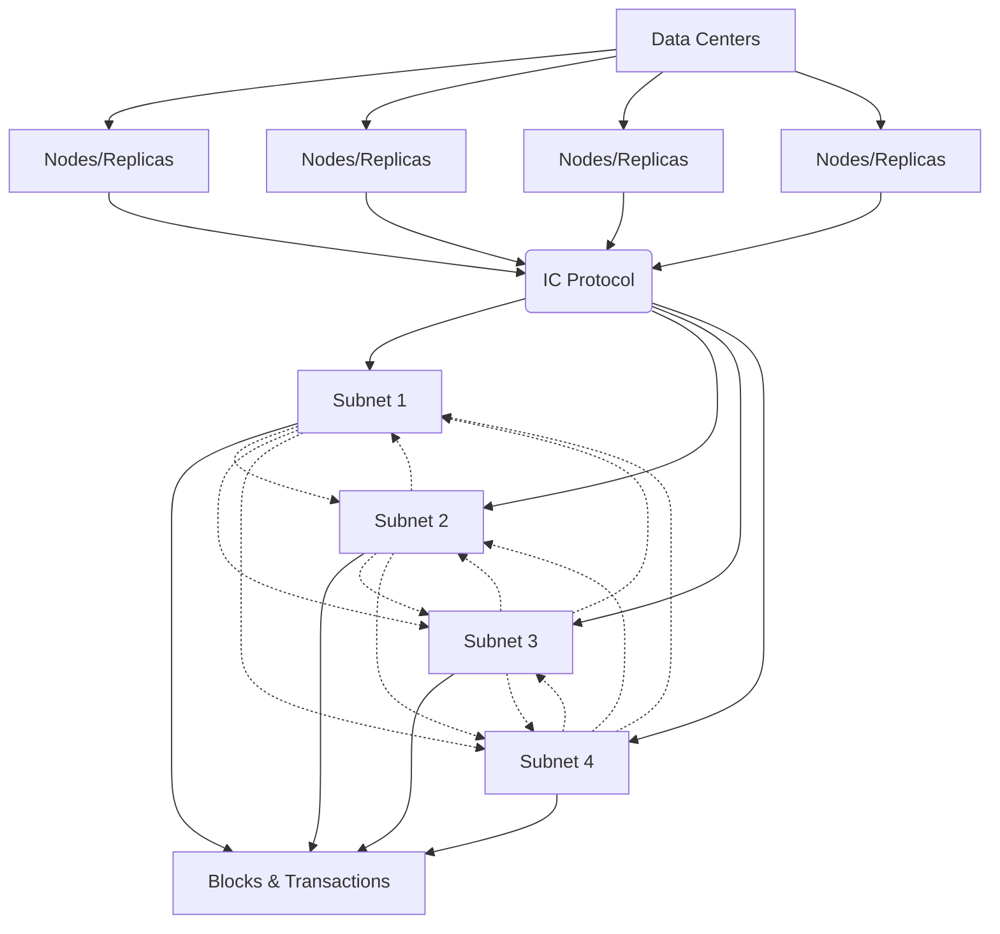

# The Internet Computer

**Internet Computer (IC):**
IC is a high-speed blockchain network designed for decentralized applications (dApps). It aims to provide unlimited scalability, security, and decentralized governance.

**Internet Computer Protocol (ICP):**
ICP refers to both the Internet Computer Protocol and the native token of the network. It enables developers to build applications directly on a decentralized cloud, reducing reliance on traditional centralized cloud services and lowering development and operating costs.

**Key Features:**

- **Decentralization:** Applications on IC are hosted on a decentralized cloud, enhancing security and reducing the risk of downtime or data breaches associated with centralized servers.
- **Scalability:** IC adopts a multi-subnet shards structure, allowing it to scale horizontally by creating new subnets. This architecture overcomes the performance bottlenecks of traditional blockchains.
- **Performance:** By scaling horizontally with subnets, IC improves throughput and lowers latency compared to non-sharded blockchains.
- **Governance:** IC features decentralized governance, empowering community-driven decision-making.

#### Architecture

Data Centers (A) contain multiple nodes or replicas (B1, B2, B3, B4). Nodes within each data center run the IC protocol (C). Nodes are selected from different data centers to form independent subnets (D1, D2, D3, D4). Each subnet independently processes and validates blocks and transactions (E1). Subnets can communicate with each other, facilitating decentralized operations.
